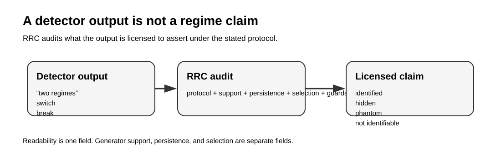
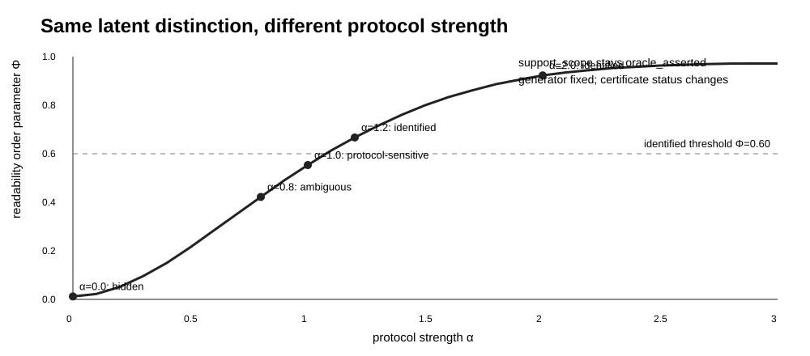
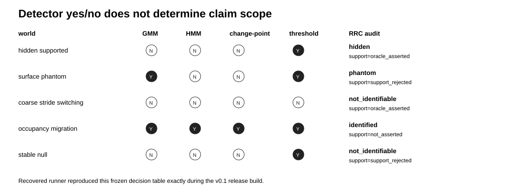
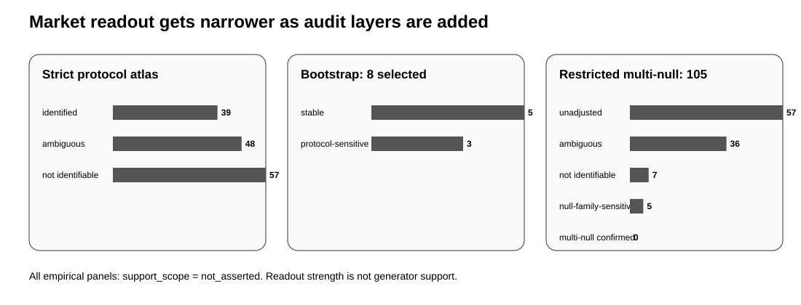

# Regime Readability Certificates

**A detector output is not a regime claim by itself.**

**Hanyu Yu · Working manuscript v3.7 · public audit artifact v0.1**

Regime detectors return objects such as clusters, switches, breaks, or threshold events. This project asks a prior question: **what is that output actually allowed to claim under the observation-compression protocol that produced it?**

An RRC keeps four claim dimensions separate instead of collapsing them into a single “regime found” label:

| Field | Question |
|---|---|
| `readability_status` | Can this protocol read the proposed distinction? |
| `support_scope` | Is generator support asserted, withheld, rejected, or unavailable? |
| `persistence_status` | Does the readout survive the declared bootstrap / perturbation audit? |
| `selection_status` | Was the protocol predeclared, discovered, confirmed, or selection-audited? |

Guard status is reported separately. The certificate is a reporting and audit layer around a detector; it is **not another detector**.



## Controlled result: the generator can stay fixed while readability changes

The controlled transition fixes a latent binary distinction and changes only the observation-compression protocol. Across `alpha = 0.0 ... 3.0`, the same supported distinction moves from **hidden → ambiguous → protocol-sensitive → identified** as access improves. This is a change in certificate status, not a physical phase transition in the generator.



The source experiment contains a 620-row alpha sweep; public v0.1 includes a 31-point across-seed summary plus a compact 190-cell resource/query status map; the full transition source tables are provenance-locked by SHA-256. The frozen certificate explicitly keeps `support_scope = oracle_asserted` while readability changes.

## Detector-output benchmark

The public synthetic runner is a curated release implementation reconstructed from the recovered v1.6 audit logic. Re-executing it reproduces the frozen five-world × four-detector decision table and RRC fields exactly; it is not represented as a byte-identical copy of the recovered source file.



Examples:

- a **hidden supported** split can be missed by GMM/HMM/change-point while a threshold fires;
- a **surface phantom** can produce visible detector separation even though support is rejected;
- a **stable null** can still trigger the threshold detector;
- a generic regime-change signal in the migration world is audited as **occupancy migration**, not fixed-slice switching.

The point is not that these simple detectors are optimal. The point is that detector yes/no alone does not determine claim scope.

## Market case: readout audit, not market ontology

The empirical case uses an ETF15 rolling correlation-network workflow as a noisy audit demonstration. **Every market certificate keeps `support_scope = not_asserted`.**

The frozen protocol atlas contains **3,888** fixed-band certificates; public v0.1 ships a compact strict-protocol summary and provenance-locks the full lattice by SHA-256. Under the strict `window=90`, `stride=1`, `min_state_n=80`, `min_state_frac=0.10` protocol, the atlas contains:

- **39** `identified_readout` certificates;
- **48** ambiguous certificates;
- **57** not-identifiable certificates.

But stronger audit layers narrow the claim:

- discovery before 2021 yields 7 candidates; only **3/7** remain identifiable in the post-2021 confirmation period;
- primary-GMM moving-block bootstrap over 8 selected bands, `B=500` at block lengths 60/90/120, yields **5 stable / 3 protocol-sensitive** readouts;
- restricted 105-protocol multi-null selection audit yields **57 unadjusted readouts, 36 ambiguous, 7 not identifiable, 5 null-family-sensitive, and 0 multi-null-confirmed** protocols;
- a focused `B=500` follow-up on the 12 strongest candidates yields **9 null-family-sensitive / 3 unadjusted**, again with **0 multi-null-confirmed**.



This is the intended behavior of the framework: **strong readout ≠ persistent readout ≠ selection-audited readout ≠ generator-supported regime**.

## Reproducibility status

### Executable now

The curated synthetic detector audit is executable from this checkout:

```bash
python -m venv .venv
source .venv/bin/activate  # Windows: .venv\\Scripts\\activate
pip install -r requirements.txt
python experiments/baseline_detector_audit.py
python scripts/check_synthetic_reproduction.py
python scripts/validate_artifact.py
```

`check_synthetic_reproduction.py` compares the regenerated detector decisions and RRC fields against the frozen v1.6 table.

### Market audit code recovered, exact frozen rerun not yet self-contained

The frozen market certificates and compact summaries are included. The recovered market-analysis source is provenance-locked in `SOURCE_DOCUMENTS.json` but is not shipped as a runnable market pipeline in v0.1 because the exact frozen `market_atlas_series.csv` (or the exact cached price panel from which it was produced) has not been recovered as a standalone source asset.

Therefore v0.1 **does not** silently fetch fresh prices and call that a reproduction of the frozen June 2026 market result. See [`REPRODUCIBILITY.md`](REPRODUCIBILITY.md).

## Manuscript

`paper/README.md` records the v3.7 manuscript provenance. The PDF and TeX source are SHA-256 locked in `SOURCE_DOCUMENTS.json` but are not duplicated in this curated GitHub release. This is a working-manuscript artifact, not a peer-reviewed publication claim.

## Repository map

```text
schema/          four-field machine-readable certificate schema + examples
experiments/     curated executable synthetic detector audit
results/         compact frozen transition, detector, and market-lattice summaries
certificates/    frozen machine-readable audit certificates
figures/         public summary figures generated from frozen tables
paper/           v3.7 manuscript provenance
scripts/         public validators and synthetic reproduction check
```

## Scope

RRC develops a **readability gate** for detector-output claims. It does not claim a universal regime detector, a universal state ontology, cross-protocol worldhood/gluing, a trading signal, or generator support for the empirical market case. See [`CLAIM_BOUNDARY.md`](CLAIM_BOUNDARY.md).
